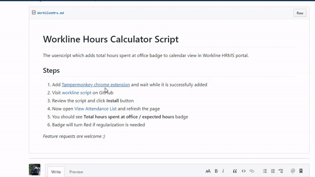

# Workline Hours Calculator Script

The userscript which adds _total hours spent at office_ badge to calendar view in Workline HRMS portal. Beware the badge might turn red!!

## Usage

## Installation Steps

1. Add [Tampermonkey chrome extension](https://chrome.google.com/webstore/detail/tampermonkey/dhdgffkkebhmkfjojejmpbldmpobfkfo/related?hl=en) and wait while it is successfully added
2. Visit [workline script](https://github.com/TheNilesh/userscripts/raw/master/workline-working-hrs-calculator.user.js) on GitHub
3. Review the script and click **Install** button
4. Now open [View Attendance List](https://app17.workline.hr/ams/AmsViewEmployeeCalenderEmp.aspx) and refresh the page
5. You should see **Total hours spent at office / expected hours** badge
6. Badge will turn red if regularization is needed

:)
